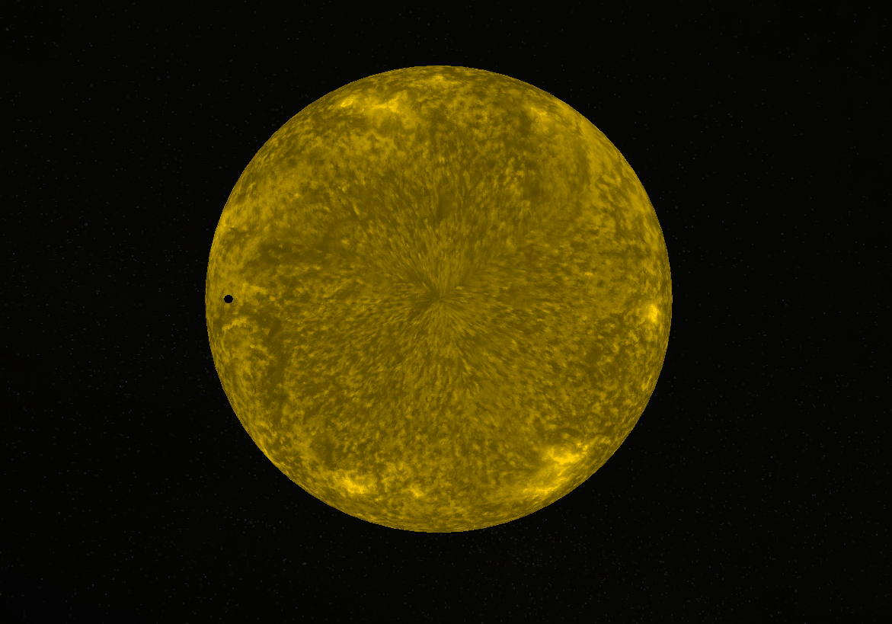
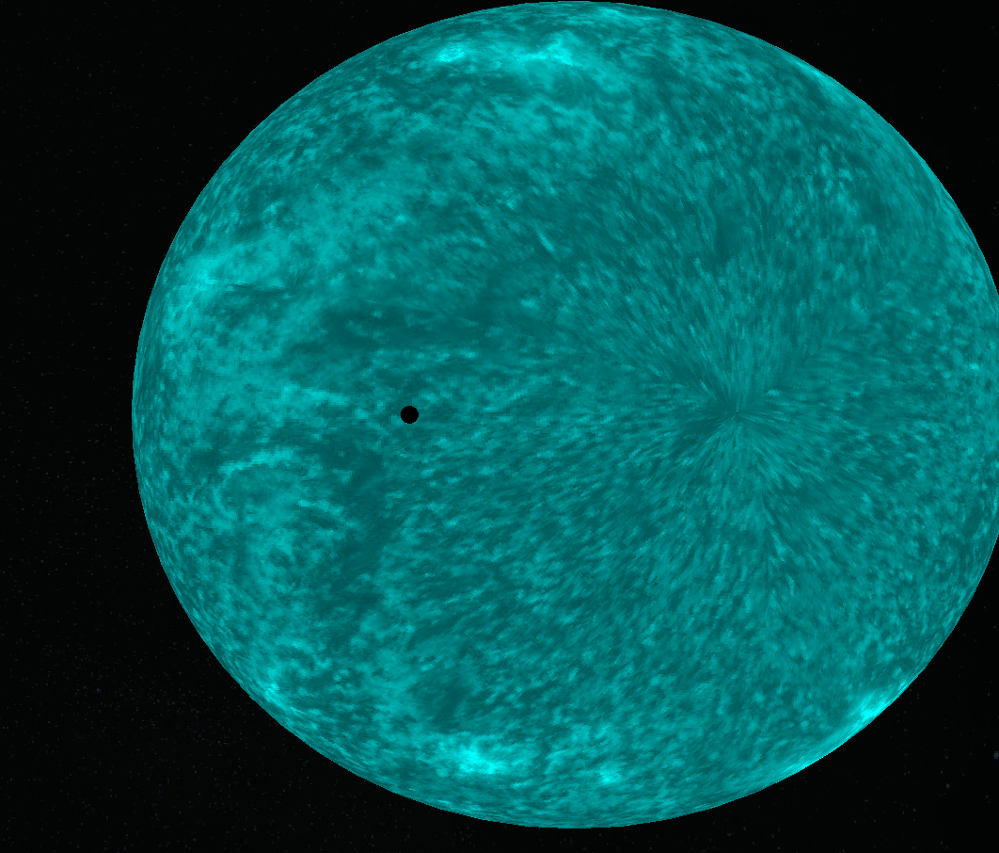

# Physics Simulator

## Goal
The goal of this program is to be able to simulate all of our current knowledge of physics.

## Method
The program is written in **Rust**.
It uses [**glu_sys**](https://github.com/moalyousef/glu-sys), [**gl**](https://github.com/rust-windowing/gl-rs/tree/master/gl) and [**glfw-rs**](https://github.com/PistonDevelopers/glfw-rs) for rendering graphics.
It uses [**image**](https://github.com/image-rs/image) for loading the textures, and [**rayon**](https://github.com/rayon-rs/rayon) for parallel computing.

## Astronomy
The first part of the simulation is **astronomy**.

### Calculations
A $\Delta t$ time is given when setting up the program.\
The lower this value is, the more precise the simulation will be, but it will also be a lot slower.
When $\Delta t$ time passes inside the simulation, the program updates the **coordinates** of the objects:\
$$celestial_x = celestial_x + v_{x_{celestial}}\Delta t$$\
$$celestial_y = celestial_y + v_{y_{celestial}}\Delta t$$\
$$celestial_z = celestial_z + v_{z_{celestial}}\Delta t$$\
After this, the program updates the **velocities** of the objects.
This is done by calculating the **gravitational forces** acting on the objects:\
$$F_a = F_a + G\frac{m_am_b}{r_{ab}^2}$$\
This calculates the gravitational force acting on A from B.
This calculation is performed on all objects, and the resulting forces are added together using vector algebra.
After these calculations are done, the velocities are updated:\
$$v_{celestial} = v_{celestial} + \frac{F_{celestial}}{m_{celestial}}\Delta t$$

### Images

